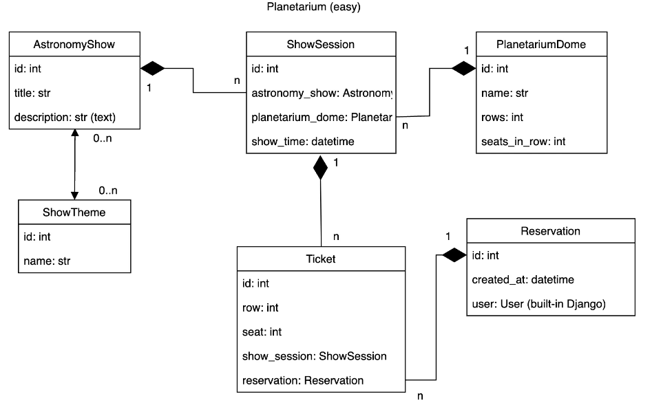

"# planetarium-api-project" 

Django REST API for the Planetarium project.

## Installation

Python 3.6+ is required.

```bash
git clone https://github.com/wonnakoo/planetarium-api-project.git
cd planetarium-api-project
python -m venv venv
source venv/bin/activate
pip install -r requirements.txt
python manage.py migrate
python manage.py runserver
```

## Features

- [x] Registration
- [x] JWT authentication
- [x] Full CRUD for admin
- [x] Creation of new orders and tickets
- [x] File upload
- [x] Pagination
- [x] Filtering feature

## DB Schema

